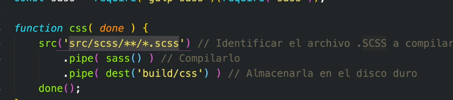
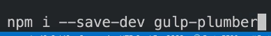
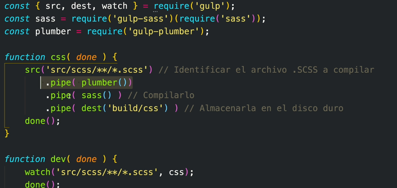

# Que es npx

Forma de ejecutar paquetes sin instalarlo

--Pipe: una accion que se realiza despues de otra
 -- Gulp : tiene todas las herramientas y nos ayuda a automatizar las tarea
--sass : tiene todo el conocimiento

## Organizacion y funcionamiento de los archivos SASS

--forward: apunta a donde estan los archivos
--use: importa multiples cosas

## Como decirle a gulp que escuche en todos los archivos y carpetas que esten el scss

el gulp file de forma recursiva entrara a las demas carpetas

- como evitar que se deje de ejecutar el gulp file
- Agregando un watch en gulp para ejecutar sass continuamente

# Mixins

- Funcionan para reutilizar codigo

- @content : reemplaza todo lo que haya dentro del mediaquery=

### Snippet para importar Variables Y Mixins

# POO PHP

### Agregando una base de datos a la clase

- Cual es el problema de crear un instacia cada vez que se crea un objeto. 
   
   R: Se crean multiples conexiones a la base de datos

Forma correcta: Se almacenan en un atributo estatico
ya que siempre son las mismas credenciales

-Todo lo que esta como static se hace referencia con (self) y lo que es publico con (this)

### 12 Octubre 2023

    - Se creo el arreglo de columnas (permite identificar que forma tienen los datos y asi poder mapear el objeto que estamos creando en el php)

### 25 Octubre 2023

